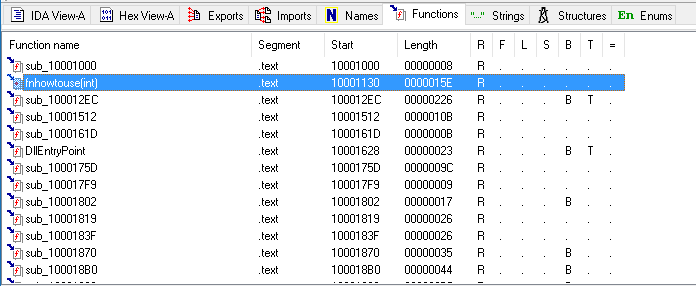
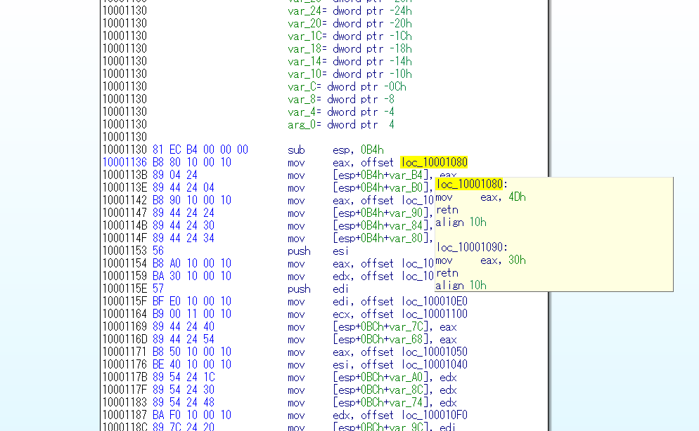
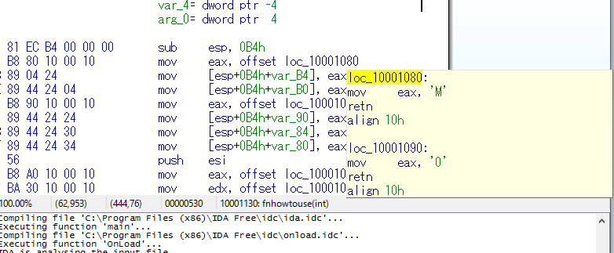

# howtouse

## バイナリを調べる
> PE32 executable (DLL) (GUI) Intel 80386, for MS Windows

ｱｯ・・・
Windowsバイナリとかほとんどやってないけど、わかるかな？

## IDAでみる
とりあえず見てみる  
DLLだから関数がある程度エクスポートされてるはず。  

これだ

なげー、けど、入れてるだけっぽい？  
ASCIIっぽいけど、どーだろね。R押してみよう。

＼デン／  
入れてるだけじゃん。  

## 解く
DLLの実行方法ググるのめんどいし目で見ればいいっしょ  
一番右の文字を縦読みするとFlag  
.text:10001130                         var_B4= dword ptr -0B4h M  
.text:10001130                         var_B0= dword ptr -0B0h M  
.text:10001130                         var_AC= dword ptr -0ACh A  
.text:10001130                         var_A8= dword ptr -0A8h {  
.text:10001130                         var_A4= dword ptr -0A4h f  
.text:10001130                         var_A0= dword ptr -0A0h c  
.text:10001130                         var_9C= dword ptr -9Ch 7  
.text:10001130                         var_98= dword ptr -98h d  
.text:10001130                         var_94= dword ptr -94h 9  
.text:10001130                         var_90= dword ptr -90h 0  
.text:10001130                         var_8C= dword ptr -8Ch c  
.text:10001130                         var_88= dword ptr -88h a  
.text:10001130                         var_84= dword ptr -84h 0  
.text:10001130                         var_80= dword ptr -80h 0  
.text:10001130                         var_7C= dword ptr -7Ch 1  
.text:10001130                         var_78= dword ptr -78h f  
.text:10001130                         var_74= dword ptr -74h c  
.text:10001130                         var_70= dword ptr -70h 8  
.text:10001130                         var_6C= dword ptr -6Ch 7  
.text:10001130                         var_68= dword ptr -68h 1  
.text:10001130                         var_64= dword ptr -64h 2  
.text:10001130                         var_60= dword ptr -60h 4  
.text:10001130                         var_5C= dword ptr -5Ch 9  
.text:10001130                         var_58= dword ptr -58h 7  
.text:10001130                         var_54= dword ptr -54h d  
.text:10001130                         var_50= dword ptr -50h 8  
.text:10001130                         var_48= dword ptr -48h d  
.text:10001130                         var_4C= dword ptr -4Ch 8  
.text:10001130                         var_44= dword ptr -44h 9  
.text:10001130                         var_40= dword ptr -40h e  
.text:10001130                         var_38= dword ptr -38h 7  
.text:10001130                         var_3C= dword ptr -3Ch e  
.text:10001130                         var_34= dword ptr -34h e  
.text:10001130                         var_30= dword ptr -30h f  
.text:10001130                         var_2C= dword ptr -2Ch a  
.text:10001130                         var_28= dword ptr -28h 9  
.text:10001130                         var_24= dword ptr -24h e  
.text:10001130                         var_20= dword ptr -20h 9  
.text:10001130                         var_1C= dword ptr -1Ch b  
.text:10001130                         var_18= dword ptr -18h 3  
.text:10001130                         var_14= dword ptr -14h 2  
.text:10001130                         var_10= dword ptr -10h e  
.text:10001130                         var_C= dword ptr -0Ch d  
.text:10001130                         var_8= dword ptr -8 8  
.text:10001130                         var_4= dword ptr -4 }  

MMA{fc7d90ca001fc8712497d88d9ee7efa9e9b32ed8}

目で見ればわかる問題でした。
